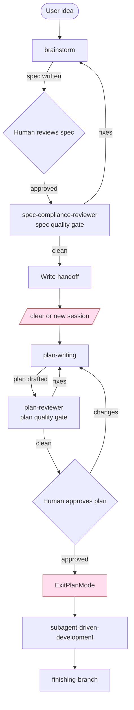

# claude-scaffolding pipeline

```mermaid
flowchart TD
    Idea([User idea]) --> BS[brainstorm]
    BS -->|spec written| HR{Human reviews spec}
    HR -->|approved| SR[spec-compliance-reviewer<br/>spec quality gate]
    SR -->|fixes| BS
    SR -->|clean| HO[Write handoff]
    HO --> STOP1[/clear or new session/]:::stop
    STOP1 --> PW[plan-writing]
    PW -->|plan drafted| PR[plan-reviewer<br/>plan quality gate]
    PR -->|fixes| PW
    PR -->|clean| HP{Human approves plan}
    HP -->|changes| PW
    HP -->|approved| STOP2[ExitPlanMode]:::stop
    STOP2 --> SDD[subagent-driven-development]
    SDD --> FIN[finishing-branch]
    classDef stop fill:#fde,stroke:#a55
```

Each box is a skill or gate. Each `:::stop` node marks where the user must clear context or exit plan mode.
