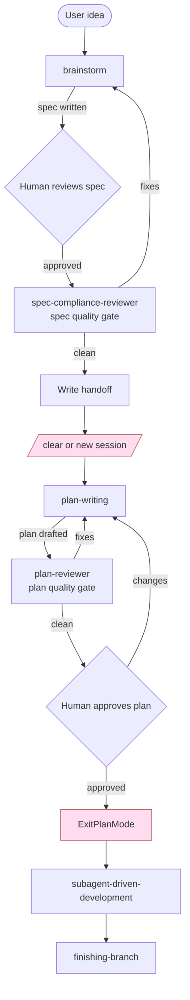

> **For agentic workers:** REQUIRED SUB-SKILL: Use `claude-scaffolding:subagent-driven-development` to implement this plan task-by-task. Steps use checkbox (`- [ ]`) syntax for tracking.

## Implementation method

**Approach:** Surgical edits + new `plan-reviewer` agent (Approach B from the spec). Every change is a markdown file create or edit — no code, no test suite. Each task targets exactly one file, applies the exact content from the spec, verifies the file content, and commits.

**Why this method:** All 14 file-level changes are independent of each other once the new files exist (the modified SKILL.md files reference the new files by relative path, but the references are inert text — they only "activate" when a user invokes the skill). Surgical edits keep the diff reviewable and avoid touching adjacent unrelated content.

**Important context for the implementer:** The worktree already contains uncommitted/untracked work that may match (or partially match) the target state of these files. Before each modification task, read the current file and compare against the target content from this plan. If the file already matches, skip the Edit/Write step and proceed to the verify-and-commit steps. If it partially matches, apply only the missing edits. Do not blindly overwrite — read first.

## Files referenced

- **Spec:** `/Users/emil.fleron/Private/Claude-plugins/.claude/worktrees/evaluate-claude-scaffolding/project-docs/specs/2026-05-06-claude-scaffolding-revisions-design.md`
- **Handoff:** `/Users/emil.fleron/Private/Claude-plugins/.claude/worktrees/evaluate-claude-scaffolding/project-docs/specs/2026-05-06-claude-scaffolding-revisions-handoff.md`
- **Coding guidelines:** none directly applicable — this is a markdown/configuration change, not application code. Skip the code-quality-reviewer step that the SDD pipeline normally runs (or have the reviewer pass through with "no code to review").

## Skills used during execution

- `claude-scaffolding:subagent-driven-development` — main execution loop; dispatches one implementer subagent per task and runs spec-compliance review between tasks.
- `claude-scaffolding:finishing-branch` — invoked after Task 11 to merge or PR the completed work.

## Definition of done

All of the following hold:

1. All 14 files (5 new + 9 modified) match the spec exactly. Run `git diff HEAD` and confirm no unintended changes.
2. The brainstorm dry-run (Task 11, Step 1) completes the new flow end-to-end: spec written → subagent spec-quality review runs → handoff written → skill stops with the prescribed message.
3. The plan-writing dry-run (Task 11, Step 2) reads spec + handoff, drafts a plan in plan-mode, dispatches plan-reviewer, asks for human approval, and never writes to `project-docs/plans/`.
4. The SDD dry-run (Task 11, Step 3) consumes tasks from the in-session plan-mode plan, not from disk.
5. The mermaid chart at `reference/pipeline-flow.md` renders without errors in a markdown previewer.
6. Every "Pipeline position" banner link resolves to `reference/pipeline-flow.md`.
7. All work is committed with conventional-commit messages and the branch is ready for merge/PR via `finishing-branch`.

---

## Task 1: Create `reference/pipeline-flow.md`

**Files:**
- Create: `claude-scaffolding/reference/pipeline-flow.md`

**Done when:** File exists with the exact content below; the mermaid block parses (no markdown-render errors).

- [ ] **Step 1: Read the current state**

Run: `ls claude-scaffolding/reference/pipeline-flow.md 2>&1`

If the file already exists, run `cat` to view it. If its content already matches the target below, skip Step 2 and proceed to Step 3. Otherwise overwrite with the target content.

- [ ] **Step 2: Write the file**

Use the Write tool to create `claude-scaffolding/reference/pipeline-flow.md` with this exact content (note the outer fence is 3 backticks; the mermaid fence inside is 3 backticks as well — the file uses standard nesting via line discipline, not 4-backtick wrapping):

````markdown
# claude-scaffolding pipeline



Each box is a skill or gate. Each `:::stop` node marks where the user must clear context or exit plan mode.
````

- [ ] **Step 3: Verify**

Run: `cat claude-scaffolding/reference/pipeline-flow.md`

Expected: file content matches the target above exactly.

- [ ] **Step 4: Commit**

```bash
git add claude-scaffolding/reference/pipeline-flow.md
git commit -m "feat(claude-scaffolding): add shared mermaid pipeline chart

Adds reference/pipeline-flow.md as the single source of truth for the
brainstorm → plan-writing → SDD pipeline visualization. All skill
SKILL.md files will link to this chart via a one-line banner."
```

---

## Task 2: Create `agents/plan-reviewer.md`

**Files:**
- Create: `claude-scaffolding/agents/plan-reviewer.md`

**Done when:** File exists with the exact content below; YAML frontmatter parses (no syntax errors).

- [ ] **Step 1: Read the current state**

Run: `ls claude-scaffolding/agents/plan-reviewer.md 2>&1`

If the file already exists and matches the target content, skip to Step 3.

- [ ] **Step 2: Write the file**

Use the Write tool to create `claude-scaffolding/agents/plan-reviewer.md` with this exact content:

```markdown
---
name: plan-reviewer
description: Reviews implementation plans for completeness, consistency, and adherence to the spec. Dispatched by the plan-writing skill BEFORE human review. Read-only. Reports a list of fixes or APPROVED.
tools: Read, Grep, Glob
---

# Plan Reviewer

Review an implementation plan and report whether it is complete and consistent. You do not implement; you read.

## Inputs
- Path to the active plan (in plan-mode's plan file)
- Path to the spec (in plan frontmatter `spec_path`)
- Path to the handoff (in plan frontmatter `handoff_path`)

## Checks
1. **Frontmatter completeness** — `spec_path`, `handoff_path`, `implementation_method`, `skills_to_use` all present and non-empty.
2. **Spec coverage** — every spec requirement has a task. List gaps.
3. **Placeholder scan** — TBD/TODO/vague phrases. List file:line.
4. **Type/method consistency** — names used in later tasks match earlier definitions. List inconsistencies.
5. **Definition of done** — every task and the overall plan has explicit DoD. List missing.

## Output
Either `APPROVED` or a bullet list:
`[BLOCKING|OBSERVATION] <task#/section> — <issue>`

Be precise and brief. No prose paragraphs.
```

- [ ] **Step 3: Verify**

Run: `cat claude-scaffolding/agents/plan-reviewer.md`

Expected: matches target content exactly. Frontmatter has `name`, `description`, `tools` (read-only set: Read, Grep, Glob).

- [ ] **Step 4: Commit**

```bash
git add claude-scaffolding/agents/plan-reviewer.md
git commit -m "feat(claude-scaffolding): add plan-reviewer agent

Read-only agent dispatched by plan-writing skill before human review.
Checks frontmatter completeness, spec coverage, placeholders, type
consistency, and definition-of-done coverage. Reports APPROVED or a
bullet list of issues with [BLOCKING|OBSERVATION] tags."
```

---

## Task 3: Create `skills/brainstorm/handoff-template.md`

**Files:**
- Create: `claude-scaffolding/skills/brainstorm/handoff-template.md`

**Done when:** File exists with the exact content below.

- [ ] **Step 1: Read the current state**

Run: `ls claude-scaffolding/skills/brainstorm/handoff-template.md 2>&1`

If the file already exists and matches the target content, skip to Step 3.

- [ ] **Step 2: Write the file**

Use the Write tool to create `claude-scaffolding/skills/brainstorm/handoff-template.md` with this exact content:

```markdown
---
status: ready-for-plan-writing
spec_path: <ABSOLUTE PATH TO SPEC>
created: YYYY-MM-DD
---

# Handoff: <Feature/Topic>

## Spec
- **Path:** <absolute spec path>

## Next step
Run `/claude-scaffolding:plan-writing` in a fresh session.

## Skills to invoke during implementation (in order)
1. `claude-scaffolding:plan-writing`
2. `claude-scaffolding:subagent-driven-development`
3. `claude-scaffolding:finishing-branch`

## Decisions locked during brainstorm
- <bullet>
- <bullet>

## Open questions for the implementer
- <bullet, or "none">

## Done when
<one or two sentences on overall feature completion>
```

- [ ] **Step 3: Verify**

Run: `cat claude-scaffolding/skills/brainstorm/handoff-template.md`

Expected: matches target content exactly.

- [ ] **Step 4: Commit**

```bash
git add claude-scaffolding/skills/brainstorm/handoff-template.md
git commit -m "feat(claude-scaffolding): add brainstorm handoff template

Template instantiated at the end of brainstorm to hand off context to a
fresh plan-writing session. Frontmatter carries spec_path so the next
session can locate the spec without user input."
```

---

## Task 4: Create `skills/brainstorm/spec-quality-review-prompt.md`

**Files:**
- Create: `claude-scaffolding/skills/brainstorm/spec-quality-review-prompt.md`

**Done when:** File exists with the exact content below.

- [ ] **Step 1: Read the current state**

Run: `ls claude-scaffolding/skills/brainstorm/spec-quality-review-prompt.md 2>&1`

If the file already exists and matches the target content, skip to Step 3.

- [ ] **Step 2: Write the file**

Use the Write tool to create `claude-scaffolding/skills/brainstorm/spec-quality-review-prompt.md` with this exact content:

```markdown
# Spec Quality Review Prompt (brainstorm gate)

You are reviewing a design spec for quality before it is handed off for plan-writing. You are NOT comparing code against the spec — you are reviewing the spec itself.

Spec path: <ABSOLUTE PATH>

Run all of these checks:
1. **Placeholder scan:** any TBD, TODO, "implement later", "fill in details", "add appropriate ..."? List file:line for each.
2. **Internal consistency:** do any sections contradict each other? Does the architecture match the feature descriptions?
3. **Scope check:** is this focused enough for a single implementation plan, or does it need decomposition?
4. **Ambiguity check:** could any requirement be interpreted two ways? Pick examples and flag them.

Report format. Either:
- `APPROVED` (no issues), or
- A bullet list of issues, each: `[BLOCKING|OBSERVATION] <file:line if applicable> — <issue>`

Be precise and brief. No prose paragraphs.
```

- [ ] **Step 3: Verify**

Run: `cat claude-scaffolding/skills/brainstorm/spec-quality-review-prompt.md`

Expected: matches target content exactly.

- [ ] **Step 4: Commit**

```bash
git add claude-scaffolding/skills/brainstorm/spec-quality-review-prompt.md
git commit -m "feat(claude-scaffolding): add spec-quality review dispatch prompt

Brainstorm-gate dispatch prompt for spec-compliance-reviewer. Distinct
from reference/spec-reviewer-prompt.md (execution-gate, code-vs-spec)
— this one reviews the spec document itself for placeholders,
contradictions, scope, and ambiguity."
```

---

## Task 5: Create `skills/plan-writing/plan-reviewer-prompt.md`

**Files:**
- Create: `claude-scaffolding/skills/plan-writing/plan-reviewer-prompt.md`

**Done when:** File exists with the exact content below.

- [ ] **Step 1: Read the current state**

Run: `ls claude-scaffolding/skills/plan-writing/plan-reviewer-prompt.md 2>&1`

If the file already exists and matches the target content, skip to Step 3.

- [ ] **Step 2: Write the file**

Use the Write tool to create `claude-scaffolding/skills/plan-writing/plan-reviewer-prompt.md` with this exact content:

```markdown
# Plan Reviewer Prompt

You are reviewing an implementation plan BEFORE the human reviews it. The plan lives in the active plan-mode plan file (path provided below). It must reference a spec and a handoff doc — read both before reviewing.

Plan path: <ABSOLUTE PATH TO PLAN-MODE PLAN FILE>
Spec path: <will be in plan frontmatter as `spec_path`>
Handoff path: <will be in plan frontmatter as `handoff_path`>

Run all of these checks:
1. **Frontmatter completeness:** spec_path, handoff_path, implementation_method, skills_to_use are all present and non-empty.
2. **Spec coverage:** for each requirement in the spec, locate the task that implements it. List any uncovered requirements.
3. **Placeholder scan:** TBD/TODO/"implement later"/"add appropriate ..." in any task — list file:line.
4. **Type / method consistency:** function/method/property names used in later tasks must match those defined in earlier tasks. List inconsistencies.
5. **Definition of done:** every task must have a "done when" criterion. The plan must have an overall DoD. List missing criteria.

Report format. Either:
- `APPROVED`, or
- A bullet list: `[BLOCKING|OBSERVATION] <task#/section> — <issue>`

Be precise and brief.
```

- [ ] **Step 3: Verify**

Run: `cat claude-scaffolding/skills/plan-writing/plan-reviewer-prompt.md`

Expected: matches target content exactly.

- [ ] **Step 4: Commit**

```bash
git add claude-scaffolding/skills/plan-writing/plan-reviewer-prompt.md
git commit -m "feat(claude-scaffolding): add plan-reviewer dispatch prompt

Dispatch prompt for plan-reviewer agent. Used by plan-writing skill
BEFORE human review. Checks frontmatter, spec coverage, placeholders,
type consistency, and DoD coverage."
```

---

## Task 6: Update `agents/spec-compliance-reviewer.md` description

**Files:**
- Modify: `claude-scaffolding/agents/spec-compliance-reviewer.md` (frontmatter `description` field only)

**Done when:** The frontmatter `description` field matches the target text below; no other lines in the file have changed.

- [ ] **Step 1: Read the current file**

Read `claude-scaffolding/agents/spec-compliance-reviewer.md`. Note the current `description` value.

- [ ] **Step 2: Replace the description**

Use Edit to replace the existing `description` block. The new description must read exactly:

```
Reviews specs for quality at the brainstorm gate (placeholders, ambiguity, internal consistency, scope) AND verifies code matches spec at the execution gate. The dispatch prompt determines mode — see `skills/brainstorm/spec-quality-review-prompt.md` for brainstorm-gate use, `reference/spec-reviewer-prompt.md` for execution-gate use.
```

If the original frontmatter uses a multiline `description: |` block, replace the body of that block with the single-line version above (no trailing newline before `model:`). If the original uses a single-line `description:`, replace the value in place.

- [ ] **Step 3: Verify**

Run: `head -10 claude-scaffolding/agents/spec-compliance-reviewer.md`

Expected: the `description` value now begins with "Reviews specs for quality at the brainstorm gate". No other frontmatter fields (e.g. `name`, `model`) have changed. Body content is unchanged.

- [ ] **Step 4: Commit**

```bash
git add claude-scaffolding/agents/spec-compliance-reviewer.md
git commit -m "refactor(claude-scaffolding): expand spec-compliance-reviewer description

The agent now serves two gates: spec-quality review at brainstorm and
code-vs-spec review at execution. Description points at the two
dispatch prompts so callers route correctly. No behavior change."
```

---

## Task 7: Update `skills/brainstorm/SKILL.md`

**Files:**
- Modify: `claude-scaffolding/skills/brainstorm/SKILL.md` — six distinct edits

**Done when:** All six edits below are applied; file passes the per-edit verification at Step 7.

The six edits, in order:

1. Insert the pipeline-position banner after the closing `---` of the frontmatter, before `# Brainstorming Ideas Into Designs`.
2. Replace the `<HARD-GATE>` body with the new text.
3. Replace the 8-item Checklist with the new 10-item version.
4. Update the DOT graph: change the terminal node from `Invoke plan-writing skill` to a path that goes through `Subagent spec review` → `Subagent approves?` → `Write handoff` → `STOP`.
5. Replace the "The terminal state is invoking plan-writing..." line with the new "handoff written, session stops" wording.
6. Replace the **Implementation** sub-section (currently "Invoke the plan-writing skill...") with the new `## After the Handoff` section.

- [ ] **Step 1: Insert pipeline-position banner**

Use Edit to insert after the closing frontmatter `---`:

old_string:
````
---

# Brainstorming Ideas Into Designs
````

new_string:
````
---

> **Pipeline position:** stage 1 of 3 — see [`reference/pipeline-flow.md`](../../reference/pipeline-flow.md).

# Brainstorming Ideas Into Designs
````

- [ ] **Step 2: Replace HARD-GATE body**

Use Edit:

old_string:
```
<HARD-GATE>
Do NOT invoke any implementation skill, write any code, scaffold any project, or take any implementation action until you have presented a design and the user has approved it. This applies to EVERY project regardless of perceived simplicity.
</HARD-GATE>
```

new_string:
```
<HARD-GATE>
Do NOT invoke any other skill, write any code, scaffold any project, or take any implementation action until the spec is written, the subagent spec-quality review has passed, and the handoff doc is written. After the handoff is written, STOP and instruct the user to /clear or open a new session before running plan-writing.
</HARD-GATE>
```

- [ ] **Step 3: Replace the Checklist**

Use Edit. The old checklist is:

old_string:
```
1. **Explore project context** — check files, docs, recent commits
2. **Ask clarifying questions** — one at a time, understand purpose/constraints/success criteria
3. **Propose 2-3 approaches** — with trade-offs and your recommendation
4. **Present design** — in sections scaled to their complexity, get user approval after each section
5. **Write design doc** — save to local .claude directory under `project-docs/specs/YYYY-MM-DD-<topic>-design.md` and commit
6. **Spec self-review** — quick inline check for placeholders, contradictions, ambiguity, scope (see below)
7. **User reviews written spec** — ask user to review the spec file before proceeding. Always use AskUserQuestion
8. **Transition to implementation** — invoke plan-creation skill to create implementation plan
```

new_string:
```
1. **Explore project context** — check files, docs, recent commits
2. **Ask clarifying questions** — one at a time, understand purpose/constraints/success criteria
3. **Propose 2-3 approaches** — with trade-offs and your recommendation
4. **Present design** — in sections scaled to their complexity, get user approval after each section
5. **Write spec** to `project-docs/specs/YYYY-MM-DD-<topic>-design.md`
6. **Inline spec self-review** — placeholder/contradiction/scope/ambiguity sweep
7. **User reviews written spec; iterate until approved**
8. **Subagent spec review** — dispatch `claude-scaffolding:spec-compliance-reviewer` with `skills/brainstorm/spec-quality-review-prompt.md`. Apply fixes. Show user diff. Iterate until APPROVED.
9. **Write handoff** to `project-docs/specs/YYYY-MM-DD-<topic>-handoff.md` using `skills/brainstorm/handoff-template.md`
10. **Stop.** Print: `Brainstorm complete. Spec at <path>. Handoff at <path>. Run /clear or open a new session, then invoke /claude-scaffolding:plan-writing.`
```

- [ ] **Step 4: Update the DOT graph**

The DOT graph has multiple lines to change. Use Edit on the full `digraph brainstorming { ... }` block.

old_string:
```
digraph brainstorming {
    "Explore project context" [shape=box];
    "Visual questions ahead?" [shape=diamond];
    "Offer Visual Companion\n(own message, no other content)" [shape=box];
    "Ask clarifying questions" [shape=box];
    "Propose 2-3 approaches" [shape=box];
    "Present design sections" [shape=box];
    "User approves design?" [shape=diamond];
    "Write design doc" [shape=box];
    "Spec self-review\n(fix inline)" [shape=box];
    "User reviews spec?" [shape=diamond];
    "Invoke plan-writing skill" [shape=doublecircle];

    "Explore project context" -> "Ask clarifying questions";
    "Ask clarifying questions" -> "Propose 2-3 approaches";
    "Propose 2-3 approaches" -> "Present design sections";
    "Present design sections" -> "User approves design?";
    "User approves design?" -> "Present design sections" [label="no, revise"];
    "User approves design?" -> "Write design doc" [label="yes"];
    "Write design doc" -> "Spec self-review\n(fix inline)";
    "Spec self-review\n(fix inline)" -> "User reviews spec?";
    "User reviews spec?" -> "Write design doc" [label="changes requested"];
    "User reviews spec?" -> "Invoke plan-writing skill" [label="approved"];
}
```

new_string:
```
digraph brainstorming {
    "Explore project context" [shape=box];
    "Ask clarifying questions" [shape=box];
    "Propose 2-3 approaches" [shape=box];
    "Present design sections" [shape=box];
    "User approves design?" [shape=diamond];
    "Write design doc" [shape=box];
    "Spec self-review\n(fix inline)" [shape=box];
    "User reviews spec?" [shape=diamond];
    "Subagent spec review" [shape=box];
    "Subagent approves?" [shape=diamond];
    "Write handoff" [shape=box];
    "STOP" [shape=doublecircle];

    "Explore project context" -> "Ask clarifying questions";
    "Ask clarifying questions" -> "Propose 2-3 approaches";
    "Propose 2-3 approaches" -> "Present design sections";
    "Present design sections" -> "User approves design?";
    "User approves design?" -> "Present design sections" [label="no, revise"];
    "User approves design?" -> "Write design doc" [label="yes"];
    "Write design doc" -> "Spec self-review\n(fix inline)";
    "Spec self-review\n(fix inline)" -> "User reviews spec?";
    "User reviews spec?" -> "Write design doc" [label="changes requested"];
    "User reviews spec?" -> "Subagent spec review" [label="approved"];
    "Subagent spec review" -> "Subagent approves?";
    "Subagent approves?" -> "Write design doc" [label="fixes"];
    "Subagent approves?" -> "Write handoff" [label="clean"];
    "Write handoff" -> "STOP";
}
```

- [ ] **Step 5: Replace the terminal-state line**

Use Edit:

old_string:
```
**The terminal state is invoking plan-writing.** Do NOT invoke any development skill, or any other implementation skill. The ONLY skill you invoke after brainstorming is plan-writing.
```

new_string:
```
**The terminal state is "handoff written, session stops".** Do NOT invoke plan-writing automatically. The user runs /clear and starts a fresh session before plan-writing.
```

- [ ] **Step 6: Replace the Implementation sub-section**

Use Edit. The old "**Implementation:**" sub-section is:

old_string:
```
**Implementation:**

- Invoke the plan-writing skill to create a detailed implementation plan
- Do NOT invoke any other skill. plan-writing is the next step.
```

new_string:
```
## After the Handoff

Print the stop message described in checklist step 10. Do NOT invoke plan-writing or any other skill.
```

- [ ] **Step 7: Verify**

Run: `git diff claude-scaffolding/skills/brainstorm/SKILL.md`

Expected diff includes (do a visual cross-check):
- Banner line added immediately after frontmatter
- HARD-GATE body replaced
- Checklist now has 10 items
- DOT graph terminal is `STOP` (doublecircle) not `Invoke plan-writing skill`
- DOT graph contains `Subagent spec review`, `Subagent approves?`, `Write handoff` nodes
- Terminal-state line says "handoff written, session stops"
- No `**Implementation:**` block remains; `## After the Handoff` is present instead

- [ ] **Step 8: Commit**

```bash
git add claude-scaffolding/skills/brainstorm/SKILL.md
git commit -m "feat(claude-scaffolding): add subagent spec-quality gate to brainstorm

Brainstorm now stops after writing the handoff. Adds:
- Pipeline-position banner linking to reference/pipeline-flow.md
- HARD-GATE rewrite covering subagent review and handoff requirements
- 10-step checklist (was 8) with subagent review and handoff steps
- DOT graph updated: terminal is STOP, not 'Invoke plan-writing skill'
- 'After the Handoff' section instructing the skill to stop, not chain"
```

---

## Task 8: Update `skills/plan-writing/SKILL.md`

**Files:**
- Modify: `claude-scaffolding/skills/plan-writing/SKILL.md` — five edit clusters

**Done when:** All five edits below are applied; file passes per-edit verification at Step 6.

The five edits, in order:

1. Insert pipeline-position banner after frontmatter.
2. Replace the "Save plans to:" block with the new "Inputs" + "Plan home" sections.
3. Update the frontmatter requirements example: add `spec_path`, `handoff_path`, `implementation_method`, `skills_to_use`; remove the redundant `Technology2` and the trailing "For agentic workers" callout that lives inside the example.
4. Insert a new "Plan body MUST contain" section after the frontmatter example block.
5. Replace the "Self-Review" + "Execution Handoff" sections with three new sections: "Subagent Plan Review", "Human Approval", "After approval".

- [ ] **Step 1: Insert pipeline-position banner**

Use Edit:

old_string:
````
---

# Writing Plans
````

new_string:
````
---

> **Pipeline position:** stage 2 of 3 — see [`reference/pipeline-flow.md`](../../reference/pipeline-flow.md).

# Writing Plans
````

- [ ] **Step 2: Replace "Save plans to" block with Inputs + Plan home**

Use Edit:

old_string:
```
**Save plans to:** in the repo .claude folder under `project-docs/plans/YYYY-MM-DD-<feature-name>.md`

- (User preferences for plan location override this default)
```

new_string:
```
## Inputs

This skill expects a spec and a handoff. Read both before drafting the plan:
- **Spec path** — read it from the handoff's frontmatter (`spec_path`).
- **Handoff path** — provided by the user when they invoke the skill, or located in `project-docs/specs/`.

If either is missing, stop and ask the user for the path. Do not draft a plan without both inputs.

## Plan home

The plan lives in the **plan-mode plan file** for the current session. Do not write a separate file under `project-docs/plans/`. After the human approves and the user runs `ExitPlanMode`, the plan-mode file is the single source of truth that `subagent-driven-development` consumes.
```

- [ ] **Step 3: Update the frontmatter requirements**

Use Edit. The old example block is:

old_string:
````
```markdown
---
title: "[Feature Name] Implementation Plan"
goal: "One sentence describing what this builds"
architecture: "2-3 sentences about approach"
tech_stack:
  - Technology1
  - Technology2
date: YYYY-MM-DD
---

> **For agentic workers:** REQUIRED SUB-SKILL: Use superpowers:subagent-driven-development (recommended) or superpowers:executing-plans to implement this plan task-by-task. Steps use checkbox (`- [ ]`) syntax for tracking.
```
````

new_string:
````
```yaml
---
title: "[Feature Name] Implementation Plan"
goal: "One sentence describing what this builds"
architecture: "2-3 sentences about approach"
tech_stack:
  - Technology1
spec_path: <ABSOLUTE PATH TO SPEC>
handoff_path: <ABSOLUTE PATH TO HANDOFF>
implementation_method: "<one-line summary of the chosen method>"
skills_to_use:
  - claude-scaffolding:subagent-driven-development
  - claude-scaffolding:tdd
  - claude-scaffolding:finishing-branch
date: YYYY-MM-DD
---
```
````

- [ ] **Step 4: Insert "Plan body MUST contain" section**

Use Edit. The new section goes immediately after the frontmatter example block (which now ends with the closing fence) and before `## Task Structure`.

old_string:
```
## Task Structure
```

new_string:
```
## Plan body MUST contain

Near the top of the plan body (under the frontmatter), include these sections — every plan, no exceptions:

1. **Implementation method** — restate the chosen approach in 2-3 sentences and the rationale (why this method over alternatives). Without this, the plan is invalid and must be rewritten.
2. **Files referenced** — the spec, the handoff, and any coding-guidelines files relevant to this work. Use absolute paths.
3. **Skills used during execution** — copy from frontmatter, with a one-line note for each on when it is invoked.
4. **Definition of done** — overall completion criteria. Each task additionally has its own "done when" criterion in its step list.

## Task Structure
```

If the file contains more than one `## Task Structure` heading (it should not), use a `replace_all=false` edit and supply more context to disambiguate.

- [ ] **Step 5: Replace Self-Review + Execution Handoff with three new sections**

Use Edit. The old block to replace:

old_string:
```
## Self-Review

After writing the complete plan, look at the spec with fresh eyes and check the plan against it. This is a checklist you run yourself — not a subagent dispatch.

**1. Spec coverage:** Skim each section/requirement in the spec. Can you point to a task that implements it? List any gaps.

**2. Placeholder scan:** Search your plan for red flags — any of the patterns from the "No Placeholders" section above. Fix them.

**3. Type consistency:** Do the types, method signatures, and property names you used in later tasks match what you defined in earlier tasks? A function called `clearLayers()` in Task 3 but `clearFullLayers()` in Task 7 is a bug.

If you find issues, fix them inline. No need to re-review — just fix and move on. If you find a spec requirement with no task, add the task.

## Execution Handoff

After saving the plan, offer execution choice:

**"Plan complete and saved to `project-docs/plans/<filename>.md`. Two execution options:**

**1. Subagent-Driven (recommended)** - I dispatch a fresh subagent per task, review between tasks, fast iteration

**2. Inline Execution** - Execute tasks in this session using executing-plans, batch execution with checkpoints

**Which approach?"**

**If Subagent-Driven chosen:**

- **REQUIRED SUB-SKILL:** Use claude-scaffolding:subagent-driven-development
- Fresh subagent per task + two-stage review

**If Inline Execution chosen:**

- **REQUIRED SUB-SKILL:** Use superpowers:executing-plans
- Batch execution with checkpoints for review
```

new_string:
```
## Subagent Plan Review (always FIRST, before human review)

Before showing the plan to the human, dispatch the plan-reviewer subagent with `skills/plan-writing/plan-reviewer-prompt.md`. The agent reads the plan, the spec, and the handoff, and reports either `APPROVED` or a list of issues.

Apply all `BLOCKING` issues inline. For `OBSERVATION` issues, decide case-by-case whether to address. Re-dispatch the reviewer until it returns `APPROVED`.

## Human Approval

Only after the plan-reviewer returns `APPROVED`, present the plan to the human. Iterate on their feedback. The skill is complete when the human explicitly approves and runs `ExitPlanMode`.

## After approval

When the human approves and runs `ExitPlanMode`, print:

> Plan approved. Next: run `/claude-scaffolding:subagent-driven-development` to execute. The plan-mode plan is the source of truth — do not re-draft.

Do not auto-invoke the next skill.
```

- [ ] **Step 6: Verify**

Run: `git diff claude-scaffolding/skills/plan-writing/SKILL.md`

Expected (visual cross-check):
- Banner line added after frontmatter
- "Save plans to" block replaced with `## Inputs` + `## Plan home` sections
- Frontmatter example contains `spec_path`, `handoff_path`, `implementation_method`, `skills_to_use`
- New `## Plan body MUST contain` section before `## Task Structure`
- `## Self-Review` and `## Execution Handoff` sections gone
- New `## Subagent Plan Review`, `## Human Approval`, `## After approval` sections present

- [ ] **Step 7: Commit**

```bash
git add claude-scaffolding/skills/plan-writing/SKILL.md
git commit -m "feat(claude-scaffolding): plan-writing now uses plan-mode and a subagent gate

- Add pipeline-position banner
- Inputs section: spec + handoff are read, not assumed
- Plan home: plan-mode file only, no project-docs/plans/ writes
- Frontmatter requires spec_path, handoff_path, implementation_method, skills_to_use
- Plan body MUST contain four named sections (impl method, files, skills, DoD)
- Replace Self-Review with subagent plan-reviewer dispatch BEFORE human review
- After approval: stop, do not auto-invoke SDD"
```

---

## Task 9: Update `skills/subagent-driven-development/SKILL.md`

**Files:**
- Modify: `claude-scaffolding/skills/subagent-driven-development/SKILL.md` — three edits

**Done when:** All three edits below are applied; file passes verification at Step 4.

- [ ] **Step 1: Insert pipeline-position banner**

Use Edit:

old_string:
````
---

# Subagent-Driven Development
````

new_string:
````
---

> **Pipeline position:** stage 3 of 3 — see [`reference/pipeline-flow.md`](../../reference/pipeline-flow.md).

# Subagent-Driven Development
````

- [ ] **Step 2: Add "Source of plan" section**

The new section is inserted after the existing "Why this skill" / preamble block and before `## The Process`. The exact insertion point: just before the line `## The Process`.

Use Edit:

old_string:
```
## The Process
```

new_string:
```
## Source of plan

The approved plan is the **plan-mode plan file from the previous session** (the user runs `ExitPlanMode` after `plan-writing`, which surfaces the plan into the active session context). Extract tasks directly from that content. If the user manually saved the plan elsewhere and supplies a path, read that path instead.

Do NOT search `project-docs/plans/` — `plan-writing` no longer writes there.

## The Process
```

If the file contains more than one `## The Process` heading, supply more context to disambiguate.

- [ ] **Step 3: Replace the example plan path**

The example workflow currently says `Read plan file once: docs/superpowers/plans/feature-plan.md`. Replace with the in-session source.

Use Edit:

old_string:
```
[Read plan file once: docs/superpowers/plans/feature-plan.md]
```

new_string:
```
[Read plan once: plan from current plan-mode session]
```

- [ ] **Step 4: Verify**

Run: `git diff claude-scaffolding/skills/subagent-driven-development/SKILL.md`

Expected:
- Banner line added after frontmatter
- New `## Source of plan` section present before `## The Process`
- Example path updated to "plan from current plan-mode session"

- [ ] **Step 5: Commit**

```bash
git add claude-scaffolding/skills/subagent-driven-development/SKILL.md
git commit -m "feat(claude-scaffolding): SDD reads plan from plan-mode, not disk

- Add pipeline-position banner
- New 'Source of plan' section: extract tasks from plan-mode session
  context, not from project-docs/plans/
- Update example workflow to reference in-session plan"
```

---

## Task 10: Add pipeline-position banners to the five remaining SKILL.md files

**Files:**
- Modify: `claude-scaffolding/skills/executing-plans/SKILL.md`
- Modify: `claude-scaffolding/skills/finishing-branch/SKILL.md`
- Modify: `claude-scaffolding/skills/tdd/SKILL.md`
- Modify: `claude-scaffolding/skills/receive-pr-review/SKILL.md`
- Modify: `claude-scaffolding/skills/rebuild-guidelines-index/SKILL.md`

**Done when:** Each of the five files has a single banner line inserted immediately after its frontmatter `---` and before its first heading. Each banner uses the stage-specific text below.

| File | `<STAGE>` text |
|---|---|
| `executing-plans/SKILL.md` | `alternate execution path (replaces \`subagent-driven-development\` when human-paced execution is preferred)` |
| `finishing-branch/SKILL.md` | `final stage — runs after all tasks complete` |
| `tdd/SKILL.md` | `invoked by implementer subagents during execution` |
| `receive-pr-review/SKILL.md` | `post-merge feedback loop` |
| `rebuild-guidelines-index/SKILL.md` | `maintenance task; not part of the main pipeline` |

The banner template:

```
> **Pipeline position:** <STAGE> — see [`../../reference/pipeline-flow.md`](../../reference/pipeline-flow.md).
```

- [ ] **Step 1: executing-plans/SKILL.md**

Read the file. Use Edit to insert the banner. Choose `old_string` and `new_string` to match around the closing `---` of the frontmatter and the next non-empty line. Example:

old_string:
````
---

# Executing Plans
````

new_string:
````
---

> **Pipeline position:** alternate execution path (replaces `subagent-driven-development` when human-paced execution is preferred) — see [`../../reference/pipeline-flow.md`](../../reference/pipeline-flow.md).

# Executing Plans
````

If the heading line differs (e.g. the first heading is something else), adapt to the file's actual first heading. Read the file first to confirm.

- [ ] **Step 2: finishing-branch/SKILL.md**

Use Edit:

old_string:
````
---

# Finishing a Development Branch
````

new_string:
````
---

> **Pipeline position:** final stage — runs after all tasks complete — see [`../../reference/pipeline-flow.md`](../../reference/pipeline-flow.md).

# Finishing a Development Branch
````

If the file's first heading differs, adapt. Read the file first.

- [ ] **Step 3: tdd/SKILL.md**

Use Edit:

old_string:
````
---

# Test-Driven Development (TDD)
````

new_string:
````
---

> **Pipeline position:** invoked by implementer subagents during execution — see [`../../reference/pipeline-flow.md`](../../reference/pipeline-flow.md).

# Test-Driven Development (TDD)
````

If the file's first heading differs, adapt. Read the file first.

- [ ] **Step 4: receive-pr-review/SKILL.md**

Use Edit:

old_string:
````
---

# Code Review Reception
````

new_string:
````
---

> **Pipeline position:** post-merge feedback loop — see [`../../reference/pipeline-flow.md`](../../reference/pipeline-flow.md).

# Code Review Reception
````

If the file's first heading differs, adapt. Read the file first.

- [ ] **Step 5: rebuild-guidelines-index/SKILL.md**

Use Edit:

old_string:
````
---

# Rebuild Guidelines Index
````

new_string:
````
---

> **Pipeline position:** maintenance task; not part of the main pipeline — see [`../../reference/pipeline-flow.md`](../../reference/pipeline-flow.md).

# Rebuild Guidelines Index
````

If the file's first heading differs, adapt. Read the file first.

- [ ] **Step 6: Verify all five**

Run:

```bash
grep -l 'Pipeline position' claude-scaffolding/skills/*/SKILL.md
```

Expected output (order may vary): all 8 SKILL.md files (the 3 from earlier tasks + the 5 from this task) appear:

```
claude-scaffolding/skills/brainstorm/SKILL.md
claude-scaffolding/skills/executing-plans/SKILL.md
claude-scaffolding/skills/finishing-branch/SKILL.md
claude-scaffolding/skills/plan-writing/SKILL.md
claude-scaffolding/skills/rebuild-guidelines-index/SKILL.md
claude-scaffolding/skills/receive-pr-review/SKILL.md
claude-scaffolding/skills/subagent-driven-development/SKILL.md
claude-scaffolding/skills/tdd/SKILL.md
```

Also confirm each banner contains the right `<STAGE>` text by visual inspection of `git diff`.

- [ ] **Step 7: Commit**

```bash
git add claude-scaffolding/skills/executing-plans/SKILL.md \
        claude-scaffolding/skills/finishing-branch/SKILL.md \
        claude-scaffolding/skills/tdd/SKILL.md \
        claude-scaffolding/skills/receive-pr-review/SKILL.md \
        claude-scaffolding/skills/rebuild-guidelines-index/SKILL.md
git commit -m "feat(claude-scaffolding): add pipeline-position banners to remaining skills

Adds a one-line 'Pipeline position' banner to each of the five
non-pipeline-core skills, each linking back to
reference/pipeline-flow.md. Stage text is tailored per skill:
- executing-plans: alternate execution path
- finishing-branch: final stage
- tdd: invoked by implementer subagents
- receive-pr-review: post-merge feedback loop
- rebuild-guidelines-index: maintenance task"
```

---

## Task 11: Verification dry-runs

**Files:**
- No files created or modified by this task. Only inspections + a small test artifact in a scratch location.

**Done when:** All five verification checks below pass and a short verification report is produced. If any check fails, fix the underlying file(s) and re-run.

> **Note for the implementer:** This task is the equivalent of integration testing. The first three checks require invoking skills end-to-end. If you (the implementer subagent) lack the ability to invoke skills directly in your sandbox, downgrade those steps to "static inspection" — confirm the SKILL.md files describe the new flow correctly and that the dispatched-prompt files exist at the right paths. Note any downgrades in the verification report so the human can run the live dry-runs separately.

- [ ] **Step 1: Brainstorm static inspection**

Read the brainstorm SKILL.md and confirm:

- The HARD-GATE block instructs the skill to stop after the handoff and not invoke plan-writing.
- The checklist has 10 items, ending with "Stop. Print: ...".
- The DOT graph terminal is `STOP`, not `Invoke plan-writing skill`.
- The "After the Handoff" section instructs the skill to print the stop message and not chain to plan-writing.
- `skills/brainstorm/spec-quality-review-prompt.md` and `skills/brainstorm/handoff-template.md` both exist (run `ls`).

If you can perform a live dry-run, do so for a tiny sample feature (e.g. "add a no-op CLI flag"); confirm the spec is written, the subagent review runs, the handoff is written, and the skill stops with the prescribed message.

- [ ] **Step 2: Plan-writing static inspection**

Read the plan-writing SKILL.md and confirm:

- "Inputs" section instructs the skill to read spec + handoff before drafting.
- "Plan home" section says plan-mode only, no `project-docs/plans/` writes.
- Frontmatter example contains `spec_path`, `handoff_path`, `implementation_method`, `skills_to_use`.
- "Plan body MUST contain" section lists the four required body sections.
- "Subagent Plan Review (always FIRST, before human review)" section is present and dispatches `plan-reviewer` with `skills/plan-writing/plan-reviewer-prompt.md`.
- "Human Approval" section is present and gated on plan-reviewer returning APPROVED.
- "After approval" section is present and instructs the skill to stop, not auto-invoke SDD.
- `skills/plan-writing/plan-reviewer-prompt.md` exists.

- [ ] **Step 3: Subagent-driven-development static inspection**

Read the SDD SKILL.md and confirm:

- Banner line is present.
- "Source of plan" section is present, instructing extraction from plan-mode session context, not from disk.
- Example workflow references "plan from current plan-mode session", not the old `docs/superpowers/plans/feature-plan.md` path.

- [ ] **Step 4: Mermaid render check**

Open `claude-scaffolding/reference/pipeline-flow.md` in a markdown previewer (or run a markdown linter that understands mermaid blocks) and confirm:

- The chart renders without parse errors.
- The two `:::stop` nodes (`STOP1` and `STOP2`) render with the `classDef stop` styling.
- All eight named nodes (Idea, BS, HR, SR, HO, STOP1, PW, PR, HP, STOP2, SDD, FIN) and the connecting edges are present.

If a previewer is unavailable, run a basic syntactic sanity check:

```bash
grep -c '```mermaid' claude-scaffolding/reference/pipeline-flow.md
```

Expected: 1.

- [ ] **Step 5: Banner-link sanity check**

Run:

```bash
grep -E 'Pipeline position.*pipeline-flow.md' claude-scaffolding/skills/*/SKILL.md | wc -l
```

Expected: 8 (one per skill SKILL.md). Spot-check that each link's relative path actually points to `reference/pipeline-flow.md` from the skill's location:

```bash
for f in claude-scaffolding/skills/*/SKILL.md; do
  link=$(grep 'pipeline-flow.md' "$f" | head -1)
  echo "$f: $link"
done
```

Confirm visually that the relative path `../../reference/pipeline-flow.md` is consistent across all eight files.

- [ ] **Step 6: Produce a verification report**

Write a short markdown report to `project-docs/plans/2026-05-07-claude-scaffolding-revisions-verification.md` with:

- One section per check above (1-5).
- For each: a one-line PASS or FAIL, and any notes (e.g. "downgraded to static inspection because subagent cannot invoke skills directly").
- A final "Overall" line: PASS if all checks PASS, otherwise FAIL with the failed checks listed.

If any check fails, halt and report back to the orchestrator (do not commit). Otherwise, commit the report.

- [ ] **Step 7: Commit (only if all checks PASS)**

```bash
git add project-docs/plans/2026-05-07-claude-scaffolding-revisions-verification.md
git commit -m "test(claude-scaffolding): add verification report for pipeline revisions

Documents pass/fail status for each of the five verification checks
prescribed by the design spec (brainstorm flow, plan-writing flow, SDD
plan source, mermaid render, banner-link sanity)."
```

---

## After Task 11

Hand control back to the orchestrator. The orchestrator will:

1. Run the SDD wrap-up review.
2. Invoke `claude-scaffolding:finishing-branch` to merge or PR the worktree branch.

Do NOT auto-invoke `finishing-branch` from this plan.
