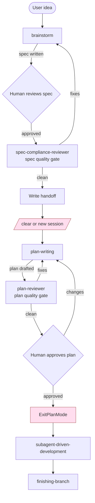

# Design Spec — `claude-scaffolding` Workflow Revisions

## Context

The user's goal file (`.claude-control/goals/evaluate-claude-scaffolding.md`) describes targeted revisions to the `claude-scaffolding` plugin. The plugin's existing pipeline is `brainstorm → plan-writing → subagent-driven-development`. Three deltas are wanted, plus a small cross-cutting change for navigability.

This document is the design spec. After approval (via `ExitPlanMode`), the brainstorm skill's checklist resumes: write the spec to `project-docs/specs/`, dispatch the new spec-quality subagent review, write the handoff, and stop. (Per the new design we are creating here — applied retroactively to its own creation.)

## Goals

1. `brainstorm` always produces a **spec AND a handoff doc**, gated by a **subagent spec review**, then **stops** (no auto-invocation of `plan-writing`).
2. `plan-writing` produces a plan **only in the plan-mode plan file**, gated by a **subagent plan review BEFORE human approval**, with mandatory content (implementation method, spec/handoff refs, skills, files, DoD).
3. A single shared mermaid pipeline chart at `claude-scaffolding/reference/pipeline-flow.md`, referenced by every skill via a one-line "you are here" pointer.
4. `subagent-driven-development` consumes the plan from in-session context after `ExitPlanMode`, not from a saved markdown.

## Resolved decisions

| Decision | Choice |
|---|---|
| Approach | Surgical edits + new `plan-reviewer` agent (Approach B) |
| Reviewer agents | Two distinct: `spec-compliance-reviewer` (extended to also do spec-quality reviews at brainstorm gate); new `plan-reviewer` (plan-writing gate only) |
| Plan persistence | Plan-mode plan file only; remove all `project-docs/plans/` writes from `plan-writing` |
| Handoff location | `project-docs/specs/YYYY-MM-DD-<topic>-handoff.md` (sibling of spec) |
| Mermaid chart location | `claude-scaffolding/reference/pipeline-flow.md` (consistent with existing project convention) |
| Per-skill resources | New brainstorm-only files inside `skills/brainstorm/`; new plan-writing-only files inside `skills/plan-writing/` |
| Skill-to-skill ref style | `claude-scaffolding:<skill-name>` |

## Files to change

### Modified — skill SKILL.md files
1. `claude-scaffolding/skills/brainstorm/SKILL.md`
2. `claude-scaffolding/skills/plan-writing/SKILL.md`
3. `claude-scaffolding/skills/subagent-driven-development/SKILL.md`
4. `claude-scaffolding/skills/executing-plans/SKILL.md` (banner only)
5. `claude-scaffolding/skills/finishing-branch/SKILL.md` (banner only)
6. `claude-scaffolding/skills/tdd/SKILL.md` (banner only)
7. `claude-scaffolding/skills/receive-pr-review/SKILL.md` (banner only)
8. `claude-scaffolding/skills/rebuild-guidelines-index/SKILL.md` (banner only)

### Modified — agent files
9. `claude-scaffolding/agents/spec-compliance-reviewer.md` — extend description to cover both gates

### New files
10. `claude-scaffolding/reference/pipeline-flow.md` — shared mermaid chart
11. `claude-scaffolding/skills/brainstorm/handoff-template.md`
12. `claude-scaffolding/skills/brainstorm/spec-quality-review-prompt.md`
13. `claude-scaffolding/skills/plan-writing/plan-reviewer-prompt.md`
14. `claude-scaffolding/agents/plan-reviewer.md`

## Detailed changes

### 10. `reference/pipeline-flow.md` (new)

Single short markdown wrapper around a mermaid chart plus a one-paragraph legend. Content:

````markdown
# claude-scaffolding pipeline



Each box is a skill or gate. Each `:::stop` node marks where the user must clear context or exit plan mode.
````

### 11. `skills/brainstorm/handoff-template.md` (new)

Short, opinionated template the brainstorm skill instantiates after subagent review.

```markdown
---
status: ready-for-plan-writing
spec_path: <ABSOLUTE PATH TO SPEC>
created: YYYY-MM-DD
---

# Handoff: <Feature/Topic>

## Spec
- **Path:** <absolute spec path>

## Next step
Run `/claude-scaffolding:plan-writing` in a fresh session.

## Skills to invoke during implementation (in order)
1. `claude-scaffolding:plan-writing`
2. `claude-scaffolding:subagent-driven-development`
3. `claude-scaffolding:finishing-branch`

## Decisions locked during brainstorm
- <bullet>
- <bullet>

## Open questions for the implementer
- <bullet, or "none">

## Done when
<one or two sentences on overall feature completion>
```

### 12. `skills/brainstorm/spec-quality-review-prompt.md` (new)

Dispatch prompt for `spec-compliance-reviewer` when used at the brainstorm gate. Distinct from the existing `reference/spec-reviewer-prompt.md` which is for the execution gate.

```markdown
# Spec Quality Review Prompt (brainstorm gate)

You are reviewing a design spec for quality before it is handed off for plan-writing. You are NOT comparing code against the spec — you are reviewing the spec itself.

Spec path: <ABSOLUTE PATH>

Run all of these checks:
1. **Placeholder scan:** any TBD, TODO, "implement later", "fill in details", "add appropriate ..."? List file:line for each.
2. **Internal consistency:** do any sections contradict each other? Does the architecture match the feature descriptions?
3. **Scope check:** is this focused enough for a single implementation plan, or does it need decomposition?
4. **Ambiguity check:** could any requirement be interpreted two ways? Pick examples and flag them.

Report format. Either:
- `APPROVED` (no issues), or
- A bullet list of issues, each: `[BLOCKING|OBSERVATION] <file:line if applicable> — <issue>`

Be precise and brief. No prose paragraphs.
```

### 13. `skills/plan-writing/plan-reviewer-prompt.md` (new)

Dispatch prompt for the new `plan-reviewer` agent.

```markdown
# Plan Reviewer Prompt

You are reviewing an implementation plan BEFORE the human reviews it. The plan lives in the active plan-mode plan file (path provided below). It must reference a spec and a handoff doc — read both before reviewing.

Plan path: <ABSOLUTE PATH TO PLAN-MODE PLAN FILE>
Spec path: <will be in plan frontmatter as `spec_path`>
Handoff path: <will be in plan frontmatter as `handoff_path`>

Run all of these checks:
1. **Frontmatter completeness:** spec_path, handoff_path, implementation_method, skills_to_use are all present and non-empty.
2. **Spec coverage:** for each requirement in the spec, locate the task that implements it. List any uncovered requirements.
3. **Placeholder scan:** TBD/TODO/"implement later"/"add appropriate ..." in any task — list file:line.
4. **Type / method consistency:** function/method/property names used in later tasks must match those defined in earlier tasks. List inconsistencies.
5. **Definition of done:** every task must have a "done when" criterion. The plan must have an overall DoD. List missing criteria.

Report format. Either:
- `APPROVED`, or
- A bullet list: `[BLOCKING|OBSERVATION] <task#/section> — <issue>`

Be precise and brief.
```

### 14. `agents/plan-reviewer.md` (new)

```markdown
---
name: plan-reviewer
description: Reviews implementation plans for completeness, consistency, and adherence to the spec. Dispatched by the plan-writing skill BEFORE human review. Read-only. Reports a list of fixes or APPROVED.
tools: Read, Grep, Glob
---

# Plan Reviewer

Review an implementation plan and report whether it is complete and consistent. You do not implement; you read.

## Inputs
- Path to the active plan (in plan-mode's plan file)
- Path to the spec (in plan frontmatter `spec_path`)
- Path to the handoff (in plan frontmatter `handoff_path`)

## Checks
1. **Frontmatter completeness** — `spec_path`, `handoff_path`, `implementation_method`, `skills_to_use` all present and non-empty.
2. **Spec coverage** — every spec requirement has a task. List gaps.
3. **Placeholder scan** — TBD/TODO/vague phrases. List file:line.
4. **Type/method consistency** — names used in later tasks match earlier definitions. List inconsistencies.
5. **Definition of done** — every task and the overall plan has explicit DoD. List missing.

## Output
Either `APPROVED` or a bullet list:
`[BLOCKING|OBSERVATION] <task#/section> — <issue>`

Be precise and brief. No prose paragraphs.
```

### 1. `skills/brainstorm/SKILL.md` (modified)

Concrete edits:

- **Line 1 (after frontmatter, before `# Brainstorming Ideas Into Designs`)**: insert
  ```markdown
  > **Pipeline position:** stage 1 of 3 — see [`reference/pipeline-flow.md`](../../reference/pipeline-flow.md).
  ```
- **HARD-GATE block (lines 12-14):** rewrite to:
  ```
  Do NOT invoke any other skill, write any code, scaffold any project, or take any implementation action until the spec is written, the subagent spec-quality review has passed, and the handoff doc is written. After the handoff is written, STOP and instruct the user to /clear or open a new session before running plan-writing.
  ```
- **Checklist (lines 22-31):** replace the 8-item list with:
  1. Explore project context
  2. Ask clarifying questions (one at a time)
  3. Propose 2-3 approaches with trade-offs
  4. Present design in sections, get approval per section
  5. Write spec to `project-docs/specs/YYYY-MM-DD-<topic>-design.md`
  6. Inline spec self-review (placeholder/contradiction/scope/ambiguity sweep)
  7. User reviews written spec; iterate until approved
  8. **Subagent spec review** — dispatch `claude-scaffolding:spec-compliance-reviewer` with `skills/brainstorm/spec-quality-review-prompt.md`. Apply fixes. Show user diff. Iterate until APPROVED.
  9. **Write handoff** to `project-docs/specs/YYYY-MM-DD-<topic>-handoff.md` using `skills/brainstorm/handoff-template.md`
  10. **Stop.** Print: `Brainstorm complete. Spec at <path>. Handoff at <path>. Run /clear or open a new session, then invoke /claude-scaffolding:plan-writing.`
- **DOT graph (lines 35-60):** update the terminal node from `Invoke plan-writing skill` to `Subagent spec review → Write handoff → STOP`. Remove the edge from "User reviews spec?" labeled "approved" → "Invoke plan-writing skill"; replace with a path through the new subagent-review and write-handoff nodes.
- **Line 62 ("The terminal state is invoking plan-writing..."):** replace with: `**The terminal state is "handoff written, session stops".** Do NOT invoke plan-writing automatically. The user runs /clear and starts a fresh session before plan-writing.`
- **"Implementation" section (lines 129-132):** replace with:
  ```
  ## After the Handoff
  
  Print the stop message described in checklist step 10. Do NOT invoke plan-writing or any other skill.
  ```

### 2. `skills/plan-writing/SKILL.md` (modified)

Concrete edits:

- **Top (after frontmatter):** insert pipeline-position banner.
- **Line 16-20 (current "Save plans to:" block):** delete entirely. Replace with new "Inputs" section:
  ```markdown
  ## Inputs
  
  This skill expects a spec and a handoff. Read both before drafting the plan:
  - **Spec path** — read it from the handoff's frontmatter (`spec_path`).
  - **Handoff path** — provided by the user when they invoke the skill, or located in `project-docs/specs/`.
  
  If either is missing, stop and ask the user for the path. Do not draft a plan without both inputs.
  
  ## Plan home
  
  The plan lives in the **plan-mode plan file** for the current session. Do not write a separate file under `project-docs/plans/`. After the human approves and the user runs `ExitPlanMode`, the plan-mode file is the single source of truth that `subagent-driven-development` consumes.
  ```
- **Frontmatter requirements (lines 49-63):** extend the required frontmatter to:
  ```yaml
  ---
  title: "[Feature Name] Implementation Plan"
  goal: "One sentence describing what this builds"
  architecture: "2-3 sentences about approach"
  tech_stack:
    - Technology1
  spec_path: <ABSOLUTE PATH TO SPEC>
  handoff_path: <ABSOLUTE PATH TO HANDOFF>
  implementation_method: "<one-line summary of the chosen method>"
  skills_to_use:
    - claude-scaffolding:subagent-driven-development
    - claude-scaffolding:tdd
    - claude-scaffolding:finishing-branch
  date: YYYY-MM-DD
  ---
  ```
- **Add "Plan body MUST contain" section** (immediately after the frontmatter block, before "Task Structure"):
  ```markdown
  ## Plan body MUST contain
  
  Near the top of the plan body (under the frontmatter), include these sections — every plan, no exceptions:
  
  1. **Implementation method** — restate the chosen approach in 2-3 sentences and the rationale (why this method over alternatives). Without this, the plan is invalid and must be rewritten.
  2. **Files referenced** — the spec, the handoff, and any coding-guidelines files relevant to this work. Use absolute paths.
  3. **Skills used during execution** — copy from frontmatter, with a one-line note for each on when it is invoked.
  4. **Definition of done** — overall completion criteria. Each task additionally has its own "done when" criterion in its step list.
  ```
- **Replace the "Self-Review" section (lines 126-136)** with:
  ```markdown
  ## Subagent Plan Review (always FIRST, before human review)
  
  Before showing the plan to the human, dispatch the plan-reviewer subagent with `skills/plan-writing/plan-reviewer-prompt.md`. The agent reads the plan, the spec, and the handoff, and reports either `APPROVED` or a list of issues.
  
  Apply all `BLOCKING` issues inline. For `OBSERVATION` issues, decide case-by-case whether to address. Re-dispatch the reviewer until it returns `APPROVED`.
  
  ## Human Approval
  
  Only after the plan-reviewer returns `APPROVED`, present the plan to the human. Iterate on their feedback. The skill is complete when the human explicitly approves and runs `ExitPlanMode`.
  ```
- **Replace the "Execution Handoff" section (lines 138-159)** with:
  ```markdown
  ## After approval
  
  When the human approves and runs `ExitPlanMode`, print:
  
  > Plan approved. Next: run `/claude-scaffolding:subagent-driven-development` to execute. The plan-mode plan is the source of truth — do not re-draft.
  
  Do not auto-invoke the next skill.
  ```

### 3. `skills/subagent-driven-development/SKILL.md` (modified)

Concrete edits:

- **Top:** insert pipeline-position banner.
- **Line 64 ("Read plan, extract all tasks with full text...") and the example workflow at line 138** (`docs/superpowers/plans/feature-plan.md`): rewrite to clarify the plan source of truth:
  ```markdown
  ## Source of plan
  
  The approved plan is the **plan-mode plan file from the previous session** (the user runs `ExitPlanMode` after `plan-writing`, which surfaces the plan into the active session context). Extract tasks directly from that content. If the user manually saved the plan elsewhere and supplies a path, read that path instead.
  
  Do NOT search `project-docs/plans/` — `plan-writing` no longer writes there.
  ```
- Remove the example path `docs/superpowers/plans/feature-plan.md` from the example block; replace with `[plan from current plan-mode session]`.

### 4-8. Other skill SKILL.md files (banners only)

Each gets one line inserted right after the frontmatter:

```markdown
> **Pipeline position:** <STAGE> — see [`../../reference/pipeline-flow.md`](../../reference/pipeline-flow.md).
```

| Skill | `<STAGE>` |
|---|---|
| `executing-plans` | alternate execution path (replaces `subagent-driven-development` when human-paced execution is preferred) |
| `finishing-branch` | final stage — runs after all tasks complete |
| `tdd` | invoked by implementer subagents during execution |
| `receive-pr-review` | post-merge feedback loop |
| `rebuild-guidelines-index` | maintenance task; not part of the main pipeline |

### 9. `agents/spec-compliance-reviewer.md` (modified)

Edit the description (frontmatter) to:

> Reviews specs for quality at the brainstorm gate (placeholders, ambiguity, internal consistency, scope) AND verifies code matches spec at the execution gate. The dispatch prompt determines mode — see `skills/brainstorm/spec-quality-review-prompt.md` for brainstorm-gate use, `reference/spec-reviewer-prompt.md` for execution-gate use.

No behavior changes; description-only update.

## Verification (after implementation)

1. **Brainstorm dry-run.** Invoke `/claude-scaffolding:brainstorm` for a tiny sample feature ("add a no-op CLI flag"). Confirm:
   - Spec is written to `project-docs/specs/<date>-<topic>-design.md`
   - Subagent spec-quality review runs (visible in agent log)
   - Handoff is written to `project-docs/specs/<date>-<topic>-handoff.md`
   - Skill stops with the prescribed message; does NOT invoke plan-writing
2. **Plan-writing dry-run.** `/clear`, then invoke `/claude-scaffolding:plan-writing` with the handoff path.
   - Skill reads spec + handoff
   - Drafts plan in plan-mode plan file with the new frontmatter and required body sections
   - Dispatches `plan-reviewer` BEFORE asking human; iterates until APPROVED
   - Asks for human approval; ExitPlanMode finishes the skill
   - Does NOT write to `project-docs/plans/`
3. **Subagent-driven-development dry-run.** Invoke `/claude-scaffolding:subagent-driven-development` after ExitPlanMode. Confirm it consumes tasks from the in-session plan, not from disk.
4. **Mermaid render.** Open `reference/pipeline-flow.md` in a markdown previewer and confirm the chart renders without errors.
5. **Banner links.** Click each "Pipeline position" link from each skill and confirm it resolves to `reference/pipeline-flow.md`.

## Out of scope

- Migrating existing `reference/implementer-prompt.md`, `reference/spec-reviewer-prompt.md`, `reference/code-quality-reviewer-prompt.md`, `reference/coding-guidelines/` to per-skill bundled locations.
- Migrating existing `.dot` (Graphviz) inline diagrams in skill SKILL.md files to mermaid (only the new shared chart is mermaid).
- Changes to other plugins (`claudemd-improve`, `commit-commands`, `create-feature`, `handoff`, `interview`, `project-management`, `team-create-feature`).
- Adding tests for skills (skills aren't unit-tested in this repo).

## Spec self-review (inline)

- **Placeholder scan:** every section above contains concrete content. No TBD/TODO.
- **Internal consistency:** the brainstorm checklist (10 steps), the DOT-graph terminal-state edit, and the HARD-GATE rewrite all describe the same flow. The plan-writing checklist matches the new frontmatter requirements and the subagent-first review order.
- **Scope:** four narrowly-scoped changes (brainstorm flow, plan-writing flow, subagent-driven-development plan-source contract, shared chart + banners). No decomposition needed.
- **Ambiguity:** "Plan home" is explicit (plan-mode file only). "Subagent review FIRST" is explicit. "Stop and instruct user" is explicit. The two prompt-template files have distinct names (`spec-quality-review-prompt.md` vs `spec-reviewer-prompt.md`) so the dispatching skill cannot confuse them.

## Post-approval steps (after `ExitPlanMode`)

1. Write this design as the spec to `project-docs/specs/2026-05-06-claude-scaffolding-revisions-design.md` in the worktree.
2. Run inline spec self-review again on the written file.
3. Dispatch `claude-scaffolding:spec-compliance-reviewer` with the new spec-quality prompt **— this is the very first dogfooding of the new flow**. Apply fixes.
4. Show the user the diff; iterate until they approve.
5. Write the handoff doc at `project-docs/specs/2026-05-06-claude-scaffolding-revisions-handoff.md`.
6. Stop. Print the prescribed message and wait for the user to `/clear` and run `/claude-scaffolding:plan-writing` next.

> Note: the plan-quality review prompt does not exist yet (it's one of the new files), so step 3 dogfoods only the spec-compliance-reviewer side, not plan-reviewer. The plan-reviewer dogfooding happens in the subsequent plan-writing session.
