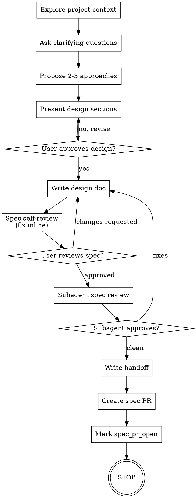

> **Pipeline position:** stage 1 of 3 — see [`reference/pipeline-flow.md`](../../reference/pipeline-flow.md).

# Brainstorming Ideas Into Designs

Help turn ideas into fully formed designs and specs through natural collaborative dialogue.

Start by understanding the current project context, then ask questions one at a time to refine the idea. Once you understand what you're building, present the design and get user approval.

<HARD-GATE>
Do NOT invoke any other skill, write any code, scaffold any project, or take any implementation action until the spec is written, the subagent spec-quality review has passed, the handoff doc is written, and the spec PR is open. After the spec PR is open, STOP. The human accepts the spec by merging that PR.
</HARD-GATE>

## Anti-Pattern: "This Is Too Simple To Need A Design"

Every project goes through this process. A todo list, a single-function utility, a config change — all of them. "Simple" projects are where unexamined assumptions cause the most wasted work. The design can be short (a few sentences for truly simple projects), but you MUST present it and get approval.

## Checklist

You MUST create a task for each of these items and complete them in order:

1. **Explore project context** — check files, docs, recent commits
2. **Ask clarifying questions** — one at a time, understand purpose/constraints/success criteria
3. **Propose 2-3 approaches** — with trade-offs and your recommendation
4. **Present design** — in sections scaled to their complexity, get user approval after each section
5. **Write spec** to `project-docs/specs/YYYY-MM-DD-<topic>-design.md`
6. **Inline spec self-review** — placeholder/contradiction/scope/ambiguity sweep
7. **User reviews written spec; iterate until approved**
8. **Subagent spec review** — dispatch `claude-scaffolding:spec-compliance-reviewer` with `skills/brainstorm/spec-quality-review-prompt.md`. Apply fixes. Show user diff. Iterate until APPROVED.
9. **Write handoff** to `project-docs/specs/YYYY-MM-DD-<topic>-handoff.md` using `skills/brainstorm/handoff-template.md`
10. **Create spec PR** — create a branch, commit the spec and handoff, push, and open a GitHub PR with `gh pr create`.
11. **Mark goal workflow** — update the goal metadata to `workflow_stage: spec_pr_open`, `spec_path`, `handoff_path`, `spec_pr_url`, and `spec_pr_number`.
12. **Stop.** Print: `Brainstorm complete. Spec PR opened at <url>. Merge it to accept the spec; after merge, dispatch /claude-scaffolding:plan-writing.`

## Process Flow



**The terminal state is "spec PR open, session stops".** Do NOT invoke plan-writing automatically. The user merges the spec PR to accept it, then manually dispatches plan-writing.

## The Process

Use AskUserQuestion for all user interactions in this process. Do not use free text to ask questions or get user input.

**Understanding the idea:**

- Check out the current project state first (files, docs, recent commits)
- Before asking detailed questions, assess scope: if the request describes multiple independent subsystems (e.g., "build a platform with chat, file storage, billing, and analytics"), flag this immediately. Don't spend questions refining details of a project that needs to be decomposed first.
- If the project is too large for a single spec, help the user decompose into sub-projects: what are the independent pieces, how do they relate, what order should they be built? Then brainstorm the first sub-project through the normal design flow. Each sub-project gets its own spec → plan → implementation cycle.
- For appropriately-scoped projects, ask questions one at a time to refine the idea
- Prefer multiple choice questions when possible, but open-ended is fine too
- Only one question per message - if a topic needs more exploration, break it into multiple questions
- Focus on understanding: purpose, constraints, success criteria

**Exploring approaches:**

- Propose 2-3 different approaches with trade-offs
- Present options conversationally with your recommendation and reasoning
- Lead with your recommended option and explain why

**Presenting the design:**

- Once you believe you understand what you're building, present the design
- Scale each section to its complexity: a few sentences if straightforward, up to 200-300 words if nuanced
- Ask after each section whether it looks right so far
- Cover: architecture, components, data flow, error handling, testing
- Be ready to go back and clarify if something doesn't make sense

**Design for isolation and clarity:**

- Break the system into smaller units that each have one clear purpose, communicate through well-defined interfaces, and can be understood and tested independently
- For each unit, you should be able to answer: what does it do, how do you use it, and what does it depend on?
- Can someone understand what a unit does without reading its internals? Can you change the internals without breaking consumers? If not, the boundaries need work.
- Smaller, well-bounded units are also easier for you to work with - you reason better about code you can hold in context at once, and your edits are more reliable when files are focused. When a file grows large, that's often a signal that it's doing too much.

**Working in existing codebases:**

- Explore the current structure before proposing changes. Follow existing patterns.
- Where existing code has problems that affect the work (e.g., a file that's grown too large, unclear boundaries, tangled responsibilities), include targeted improvements as part of the design - the way a good developer improves code they're working in.
- Don't propose unrelated refactoring. Stay focused on what serves the current goal.

## After the Design

**Documentation:**

- Write the validated design (spec) to the project .claude folder under `project-docs/specs/YYYY-MM-DD-<topic>-design.md`
  - (User preferences for spec location override this default)

**Spec Self-Review:**
After writing the spec document, look at it with fresh eyes:

1. **Placeholder scan:** Any "TBD", "TODO", incomplete sections, or vague requirements? Fix them.
2. **Internal consistency:** Do any sections contradict each other? Does the architecture match the feature descriptions?
3. **Scope check:** Is this focused enough for a single implementation plan, or does it need decomposition?
4. **Ambiguity check:** Could any requirement be interpreted two different ways? If so, pick one and make it explicit.

Fix any issues inline. No need to re-review — just fix and move on.

**User Review Gate:**
After the spec review loop passes, ask the user to review the written spec before proceeding:

> "Spec written and committed to `<path>`. Please review it and let me know if you want to make any changes before we start writing out the implementation plan."

Wait for the user's response. If they request changes, make them and re-run the spec review loop. Only proceed once the user approves.

## After the Handoff

Create the spec PR before stopping:

```bash
git switch -c spec/<topic>
git add <spec-path> <handoff-path> .claude-control/goals/<goal>.md
git commit -m "docs: add <topic> spec"
git push -u origin spec/<topic>
gh pr create --title "<topic> spec" --body "Spec and handoff for <goal>."
```

If `gh` is missing or `gh auth status` fails, stop with a clear blocked state and tell the user authentication is required before the spec can enter `spec_pr_open`.

After the PR is created, update the active goal metadata:

```yaml
metadata:
  workflow_stage: spec_pr_open
  spec_path: <spec-path>
  handoff_path: <handoff-path>
  spec_pr_url: <url>
  spec_pr_number: <number>
```

Print the stop message described in checklist step 12. Do NOT invoke plan-writing or any other skill.

## Key Principles

- **One question at a time** - Don't overwhelm with multiple questions
- **Multiple choice preferred** - Easier to answer than open-ended when possible
- **YAGNI ruthlessly** - Remove unnecessary features from all designs
- **Explore alternatives** - Always propose 2-3 approaches before settling
- **Incremental validation** - Present design, get approval before moving on
- **Be flexible** - Go back and clarify when something doesn't make sense
