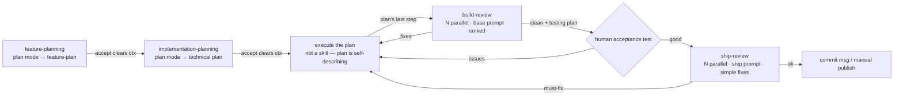

# development-flow: Plan → Build → Ship

Each box is a skill or gate. Planning skills accept via `ExitPlanMode` (saves +
clears context). Reviews run standalone, any time, read-only. The human commits
and publishes manually.
